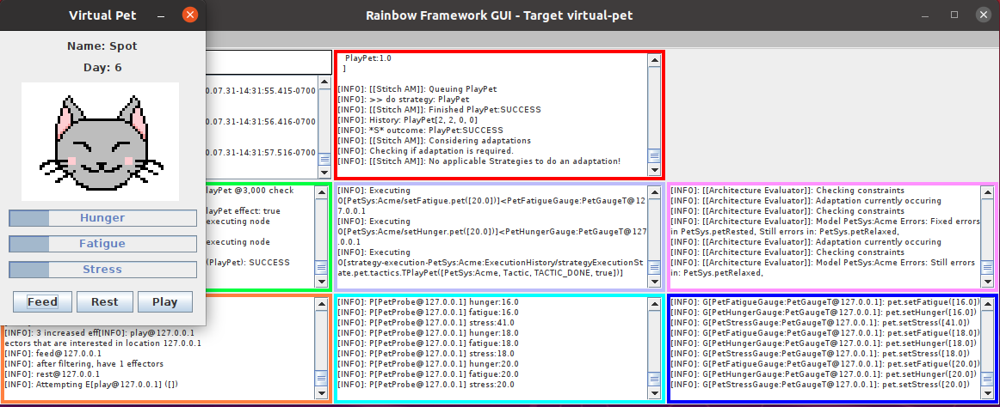

# Rainbow Virtual Pet

Rainbow Virtual Pet is a simple use case of the Rainbow Autonomics Framework developed at Carnegie Mellon University which has been made available at their [github project page](https://github.com/cmu-able/rainbow).

The goal of this project is to showcase the framework managing the maintenance of a virtual pet by modeling the pet as a system. Model constraints define system "health" and adaptation strategies seek to improve the state of the system when constraints no longer hold.

The pet has hunger, fatigue, and stress indicators that are accessed through Rainbow Probes. Rainbow Gauges maintain a model of the pet where model constraints ensure that the pet's attributes stay within certain thresholds. Strategies call Rainbow Effectors to execute feed, rest, and play actions on the pet.

##### Building

`build.sh` uses maven to build the project. This will create a `dist` directory with an executable jar, project environment directory, and a shell script. Executing the script (`dist/run_rainbow.sh`) will start the application. 

Requires: Java 8

Virtual Pet source code can be found [here](https://github.com/BCoronado1/JavaVirtualPet).

